👉[English](README.en.md)

# dotfiles

快速配置\*nix开发环境以及装机必备神器。😱

## 1 ssh

如果条件允许的话，建议使用[mosh](https://mosh.org/)替代ssh，mosh基于UDP传输，比ssh更稳定、更容忍网络故障和延迟，不会像ssh那样轻易掉线。由于很多服务器目前并没有安装mosh，使用ssh的还是占主流，并且mosh也不支持ssh-agent、X11-forward等。因此在本地需要配置下ssh。

### 1.1 快速配置

在ssh目录下直接运行`setup.sh`脚本即可，不需要其它额外配置。

### 1.2 连接复用

通常我们ssh连接到一台服务器退出后连接即断开，再次连接时会重新建立连接，需要重新校验密钥或密码。如果使用密码登录，则需要反复输入密码，在需要管理大量远程服务器时效率极低。密码是静态不变使用sshpass可以避免每次输入密码，但显然这是极其不安全的。如果密码是动态生成的，比如跳板机，每次需要打开手机查看动态密码非常麻烦。

ssh连接复用是指一旦成功建立远程主机的ssh连接会保持一段时间的session，在session有效期内可以复用该连接，不需要重新做身份验证。这有点类似sudo命令，第一次输入密码后，再次执行sudo命令不需要输入密码了。

ssh连接复用配置如下:

```
ControlMaster auto
ControlPersist yes
ControlPath ~/.ssh/socks/%h-%p-%r
```

第一次建立连接时会在ControlPath目录下生成一个socket文件，文件格式为`%h-%p-%r`, 其中`%h`表示远程主机名，`%p`指连接的端口,`%r`是登录用户名。

**注意：** 

* `.ssh`目录权限应设为`600`.
* `~/.ssh/socks`目录需要手动创建。

### 1.3 保持会话

ssh成功登录到一台服务器即创建了一个新的会话，当该会话超过一定时间内没有接收任何请求时，会话会自动断开连接。有时这不是我们所期望的，比如ssh到一台服务器后，google下资料回来发现ssh断开了。

为了保持会话，可以设置ssh客户端每隔一段时间自动发送一个心跳，比如每隔60s发送一个hello包。

```
ServerAliveInterval 60
```

我们还可以设置允许发送心跳的最大数量`ServerAliveCountMax`，当超过这个数量仍然没有接收用户响应时则会自动断开连接。

### 1.4 禁用主机key校验

ssh连接时会检查主机的公钥，如果第一次连接主机会显示该主机的公钥指纹，需要用户确实是否信任该主机。

```
The authenticity of host '192.168.56.4 (192.168.56.4444)' can't be established.
RSA key fingerprint is a3:ca:ad:95:a1:45:d2:57:3a:e9:e7:75:a8:4c:1f:9f.
Are you sure you want to continue connecting (yes/no)?
```

如果我们跑后台脚本时就会堵塞直到接收用户输入，导致后台脚本不能正常运行。

如果确认信任该主机并且保证不会被劫持攻击的话，可以跳过主机公钥校验，配置如下:

```
StrictHostKeyChecking no
UserKnownHostsFile /dev/null
```

如果通过shell连接，不建议禁用公钥校验。

## 2 tmux


### 2.1 快速配置

运行`tmux/setup.sh`脚本即可，不需要其它额外配置。

### 2.2 配置说明

`prefix`键为默认的`ctrl-b`，个人感觉`ctrl-b`挺方便的，很多人设置为`ctrl-a`，这会与在命令行下快速移动光标到行首冲突，需要按两下ctrl-a。

设置分屏:

```
# Split windows
bind \ split-window -h
bind - split-window -v
```

这样容易记住，`|`垂直分屏，`-`水平分屏。

禁用windows自动命名，主要是它会覆盖原来的名字:

```
set-option -g allow-rename off  # prevent system from renaming our window
```

设置windows从1开始索引：

```
set -g base-index 1 # window index from 1, not zero
```

重新加载配置文件（prefix+r)：

```
bind r source-file ~/.tmux.conf \; display "Reloaded!"
```

打开一个临时窗口查看man手册:

```
bind-key / command-prompt "split-window -h 'exec man %%'"
```

只需要输入`prefix+/`,然后输入需要查询的命令即可。

## 2.3 主题方案

选用的主题是Solarized，参考[Making tmux Pretty and Usable - A Guide to Customizing your tmux.conf](http://www.hamvocke.com/blog/a-guide-to-customizing-your-tmux-conf/)，为了和iterm以及vim集成，手动调节了部分颜色，包括panel boder颜色以及windows菜单颜色等。

status bar设置在顶部，为了避免和vim status重叠。

## 3 vim

注意：当加载太多插件时，vim启动会很慢，并且vim 8以前插件加载都是同步的，必须等待插件执行完才能继续下一个任务. 因此我把自动生成tags功能默认是关闭的, 避免每打开一个文件都要卡顿几秒。可以使用[neovim](https://neovim.io/)替代vim。

### 3.1 Setup

在`dotfiles/vim`目录下运行`setup.sh`即可自动完成配置，配置过程中会自动安装vundle以及插件。

配置过程中可能出现Solarized方案不存在错误，由于该方案还没有安装，直接忽略该错误即可。

除了以上配置还需要系统完成以下包的安装:

* `ctags`
* `cmake`
* `g++`(CentOS下包名为`gcc-c++`)
* `python-devel`

检查ctags是否安装成功:

```
ctags --list-languages
```

最后配置YCM，在`~/.vim/bundle/YouCompleteMe`目录下运行`install.py`脚本。注意执行该脚本时必须已经安装`cmake`、`g++`、`python-devel`等，否则会build失败。

检查是否配置成功,大多数功能一般不会有什么问题，不需要检查，唯独自动补全功能需要确定是否工作，随便编辑一个C文件，看是否支持自动补全。

### 3.2 全局配置

全局配置指vim原生支持的功能配置，不需要安装任何插件。

#### 3.2.1 通用配置

```vim
" 开启文件类型侦测
filetype on
" 根据侦测到的不同类型加载对应的插件
filetype plugin on
" 自动缩进
filetype indent on

" 开启语法高亮功能
syntax enable
" 允许用指定语法高亮配色方案替换默认方案
syntax on

set nocompatible "禁用vi兼容模式
set incsearch "开启增量搜索
set ignorecase "搜索忽略大小写
set wildmenu "vim命令自动补全
set autoread "文件自动更新
set gcr=a:block-blinkon0 "禁止光标闪烁
set laststatus=2 "总是显示状态栏
set ruler "显示光标位置
set number "显示行号
set cursorline "高亮显示当前行
"set cursorcolumn "高亮显示当前列
set hlsearch "高亮显示搜索结果
set backspace=2 "回退键生效
```

#### 3.2.2 设置Leader键

Leader键是快捷键的前缀，类似于tmux的prefix键。根据个人习惯可以自定义Leader键，有人设置为`;`(分号)，也有人设置为空格键`"let mapleader="\<space>"`，空格键默认功能是向右移动光标，如果设置为Leader键，恢复原来的功能需要按两次空格键。为了方便，我设置Leader键为`'`（单引号):

```vim
let mapleader="'"
```
#### 3.2.3 设置制表符

设置制表符占用4个空格字符，并且自动扩展为4个空格:

```vim
set expandtab " 将制表符扩展为空格
set tabstop=4 " 制表符占用空格数
set shiftwidth=4 " 设置格式化时制表符占用空格数
set softtabstop=4 " 让 vim 把连续数量的空格视为一个制表符
```

#### 3.2.4 打开上次关闭文件的位置

打开一个文件时vim光标位置默认位于第一行，如果需要设置光标位于上次关闭时位置，配置如下:

```vim
if has("autocmd")
      au BufReadPost * if line("'\"") > 1 && line("'\"") <= line("$") | exe "normal! g'\"" | endif
endif
```
**注意：**如果不生效，可能是由于~/.viminfo没有访问权限，需要修改owner:

```bash
chown yourname ~/.viminfo
```

#### 3.2.5 快捷键配置

```vim
" 设置快捷键将选中文本块复制至系统剪贴板
vnoremap <Leader>y "+y

" 设置快捷键将系统剪贴板内容粘贴至 vim
nmap <Leader>p "+p

" 定义快捷键关闭当前分割窗口
nmap <Leader>q :q<CR>

" 定义快捷键保存当前窗口内容
nmap <Leader>w :w<CR>

" 定义快捷键保存所有窗口内容并退出 vim
"nmap <Leader>WQ :wa<CR>:q<CR>

" 不做任何保存，直接退出 vim
"nmap <Leader>Q :qa!<CR>

" 跳转至右方的窗口
nnoremap <Leader>l <C-W>l

" 跳转至左方的窗口
nnoremap <Leader>h <C-W>h

" 跳转至上方的子窗口
nnoremap <Leader>k <C-W>k

" 跳转至下方的子窗口
nnoremap <Leader>j <C-W>j

" 清除高亮显示
nmap <Leader>N :noh<CR>
" 定义快捷键在结对符之间跳转
nmap <Leader>M %

nnoremap <Leader>g <C-]>
nnoremap <Leader>b <C-t>
```

#### 3.2.6 gvim配置

图形化vim配置，通常不需要:

```vim
" 禁止显示滚动条
set guioptions-=l
set guioptions-=L
set guioptions-=r
set guioptions-=R

" 禁止显示菜单和工具条
set guioptions-=m
set guioptions-=T
```

### 3.3 插件列表

#### 1. Vundle

Vim bundle的简写，它是当前最流行的vim插件管理工具。虽然目前最新版vim已经内置支持插件管理了，不过鉴于目前使用的大多数还是7.3、7.4，因此本人仍使用vundle插件管理，以下所有的插件均是通过vundle管理的。

安装vundle:

```
git clone https://github.com/VundleVim/Vundle.vim.git ~/.vim/bundle/Vundle.vim
```

在vim配置文件`~/.vimrc`中启用vundle:

```vim
set rtp+=~/.vim/bundle/Vundle.vim
" vundle 管理的插件列表必须位于 vundle#begin() 和 vundle#end() 之间
call vundle#begin()
Plugin '1'
Plugin '2'
...
Plugin 'n'
" 插件列表结束
call vundle#end()
```

查看插件列表:

```vim
:PluginList
```

安装插件:

```
:PluginInstall
```

或者

```bash
vim "+PluginInstall" "+x" "+x"
```

更新插件:

```
:PluginUpdate
```

禁用插件直接在~/.vimrc注释插件即可，如果需要从本地彻底删除，运行以下命令:

```
:PluginClean
```

或者

```
vim "+PluginClean" "+x" "+x"
```

#### 2. vim-powerline

主要功能是使vim底部的状态栏更美观。

#### 3. vim-cpp-enhanced-highlight

c++语法高亮增强，支持c++11/14，增加标准库/boost类型和函数高亮。

#### 4. vim-signature & BOOKMARKS--Mark-and-Highlight-Full-Lines

书签可视化以及书签行高亮。在命令行下输入m然后任意字母创建标签,效果如图:

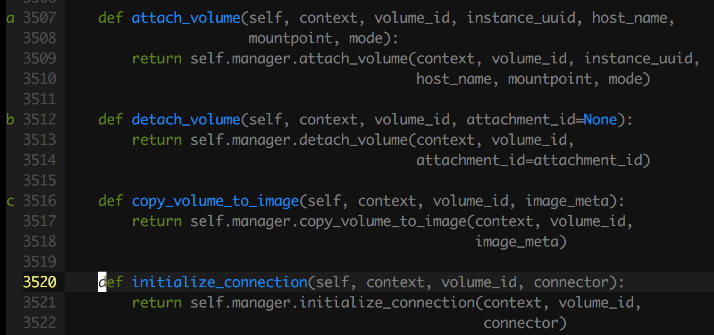

#### 5. tagbar

taglist的增强版本，需要安装ctags包，设置的快捷键为<Leader>键+t:
即按下`'`然后按`t`打开标签列表：

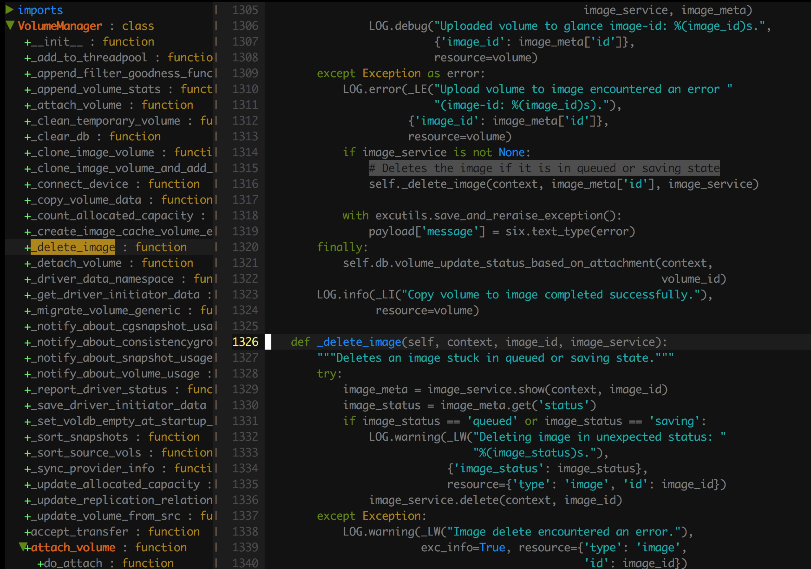

其它配置项如下:

```
let tagbar_left=1
nnoremap <Leader>t :TagbarToggle<CR>
let tagbar_width=32
"tagbar 子窗口中不显示冗余帮助信息
let g:tagbar_compact=1
```

#### 6. nerdcommenter

方便批量注释，能够自动识别语言，比如shell增加`#`，而C语言使用`/* ... */`等。

使用可视化v`(Shift+V)`选中文本后，使用<Leader> cc注释，使用<Leader> cu取消注释:


#### 7. nerdtree

项目文件浏览，使用<Leader> f打开:


#### 8. YouCompleteMe

Vim自动补全插件，能够集成ctags以及jedi等，效果如图:

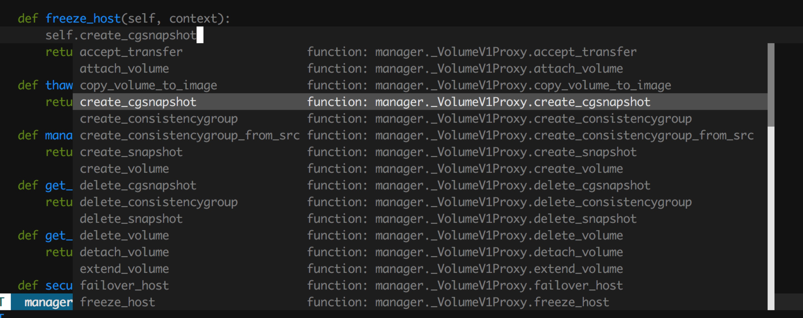

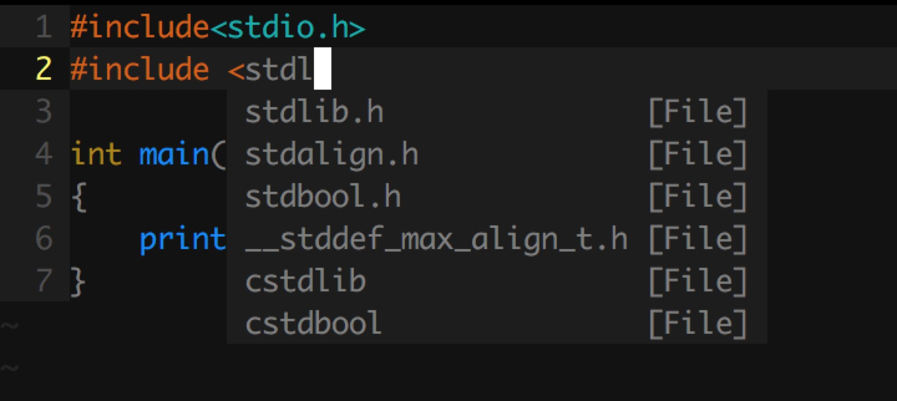

#### 9. ctrlp

文件搜索功能，能够在vim上快速搜索文件并打开。在命令行模式下输入`ctrl+p`触发:

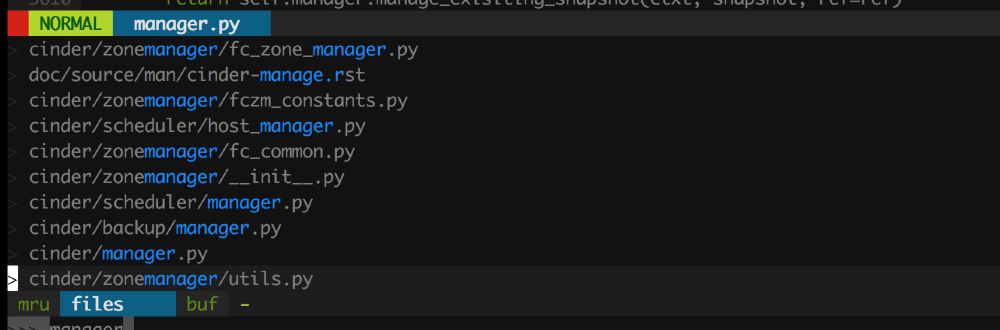

#### 10 vim-easymotion

快速在文本中跳转，f命令的增强版，按两下Leader键和f命令组合使用,比如跳转在有a字母的位置：

```
<Leader> <Leader> fa
```

此时再按高亮显示的字母即可以快速跳转到选择的位置。

效果如图:

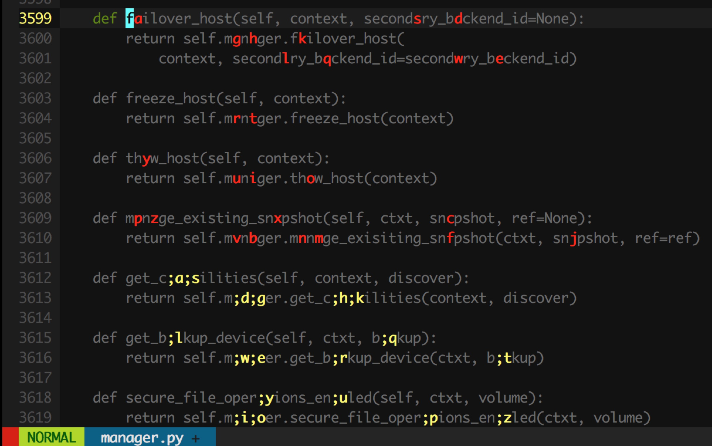

#### 11. vim-surround

处理各种括号以及html标签，比如`()[]()`

比如把`"Hello World！"`删除引号转化为`Hello World!`，输入`ds"`. 需要把双引号修改为单引号，输入`cs"'`。

参考[sdf13](http://vim.spf13.com/):

```
  Old text                  Command     New text ~
  "Hello world!"           ds"         Hello world!
  [123+456]/2              cs])        (123+456)/2
  "Look ma, I'm HTML!"     cs"<q>      <q>Look ma, I'm HTML!</q>
  if x>3 {                 ysW(        if ( x>3 ) {
  my $str = whee!;         vllllS'     my $str = 'whee!';
```

#### 12. vim-bracketed-paste

在vim使用系统粘贴板粘贴代码时，vim会根据缩进语法自动格式化代码，插入的多余的缩进符，这往往不是我们所预期的。比如我复制的内容为:

```python
class HelloObject(object):

    def __init__(self):
        pass

    def sayHello():
        print("HelloWorld!")


if __name__ == "__main__":
    HelloObject().sayHello()
```

在vim中insert粘贴内容效果为:

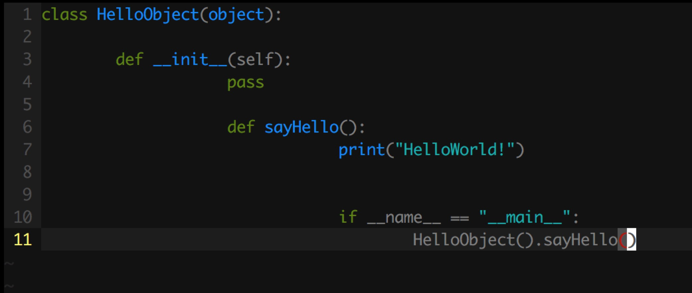

通常的做法是使vim进入paste模式:

```vim
:set paste
```

每次粘贴复制都需要切换paste模式，这太麻烦了，而且容易忘记。我们可以利用[bracketed paste mode](http://cirw.in/blog/bracketed-paste)，该模式下粘贴时会自动在两端加入特殊字符，如复制的内容如果是`HelloWorld`，粘贴后的内容为:

```
00~HelloWorld01~
```

这使程序能够根据这些特殊字符判断输入是粘贴的还是用户手动输入的。vim-bracketed-paste插件正是利用了这个特性，判断如果是粘贴的内容，自动进入paste模式，内容粘贴结束，自动退出paste模式，完美解决了以上问题。

#### 其它插件

```vim
* vim-scripts/grep.vim' "在命令行模式使用grep命令，:Grep
* vim-scripts/ShowTrailingWhitespace.git' "高亮显示行尾的多余空白字符
* vim-scripts/indentpython.vim.git'
* vim-scripts/Solarized.git' "主题方案
* nathanaelkane/vim-indent-guides.git' "缩进对齐显示
* davidhalter/jedi-vim' "python自动补全，不依赖于tags,但比较慢，可以使用indexer替换，但不能跳转项目外
* vim-scripts/Markdown' " Markdown语法高亮
* ekalinin/Dockerfile.vim' " Dockerfile语法高亮
* fatih/vim-go " go语言语法高亮
```

### 3.4 Theme

使用Solarized主题方案。

## 4 zsh

### 4.1 配置

直接运行`zsh/setup.sh`,该脚本会自动安装oh-my-zsh。

### 全局配置

待补充。

### 4.2 插件列表

#### git

提供git常用简化别名，并且当工作目录在git项目下会自动显示所在的分支。

#### zsh-syntax-highlighting

语法高亮，命令错误或者命令返回错误会高亮显示。


上图中`sl`命令不存在，因此红色高亮显示，并且`➜`显示红色，表示上条命令返回了错误码。

#### extract

只需要输入`x+文件名`就能解压缩文件，不需要知道它是tar、gz还是xz。

#### z

类似autojump，输入`z`能够查看cd历史记录以及权重，输入`z 模糊路径`能够快速cd到匹配的目录中。

#### safe-paste

默认情况下当复制粘贴文本到终端时，当遇到换行符，终端会立马执行该命令。如果同时复制多行内容，终端会把所有内容根据换行符拆分成多个命令依次执行。这显然不是我们所期望的。利用[bracketed paste mode](http://cirw.in/blog/bracketed-paste)特性，终端可以通过两端的特殊字符判断输入是粘贴的还是手动输入的，从而避免遇到换行符就立马执行。

### 4.3 主题列表

使用默认的`robbyrussell`主题。

### 4.4 alias列表

待补充。

```bash
alias rm='rm -i'
alias mv='mv -i'
alias cp='cp -i'
alias grep='grep -E'
alias df='df -h'

# alias for harborclient
alias harbor='docker run \
 -e HARBOR_USERNAME="admin" \
 -e HARBOR_PASSWORD="Harbor12345" \
 -e HARBOR_URL="http://192.168.56.4" \
 --net host --rm krystism/harborclient'
# get my ip 
alias my_ip="docker run -t -i --rm alpine sh -c 'ip route get 8.8.8.8' | cut -d ' ' -f 8 | head -n 1"

# ipcalc not on Mac
ipcalc='docker run -t -i --rm alpine ipcalc'
 
```
## 5 pip

使用中科大源:

```bash
cat >>~/.pip/pip.conf <<EOF
[global]
index-url = https://pypi.mirrors.ustc.edu.cn/simple
EOF
```
## 6 git

注：使用tig命令替换git命令。

### 6.1 基本配置

解决`git status`无法显示中文:

```
[core]
    quotepath = false # 解决git status中文乱码
```

### 6.2 颜色方案

```
[color]
    ui = true
[color "branch"]
    current = yellow reverse
    local = yellow
    remote = green
[color "diff"]
    meta = yellow bold
    frag = magenta bold
    old = red
    new = green
```

### 6.3 alias列表

待补充。

## 7 iterm

颜色方案基于内置Solarized Dark主题调节，最终效果如图:

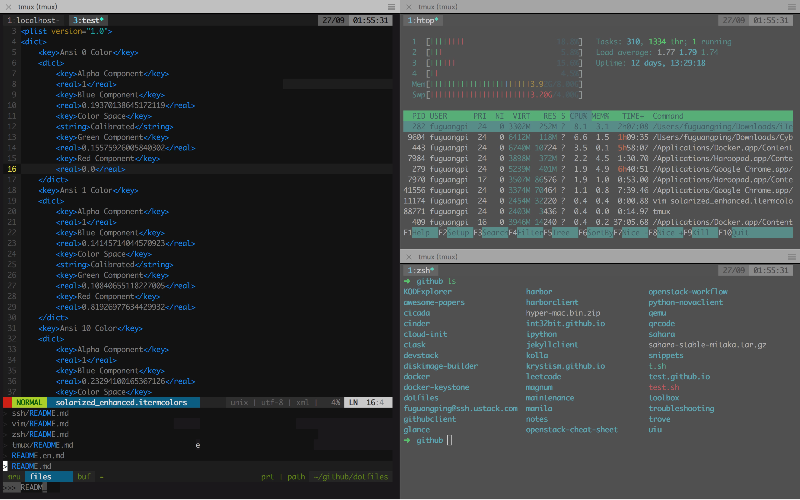


## 附 非常棒的命令行工具（装机必备神器)

### [ag](https://github.com/ggreer/the_silver_searcher)

比grep、ack更快的递归搜索文件内容。

### [tig](https://github.com/jonas/tig)

字符模式下交互查看git项目。
 
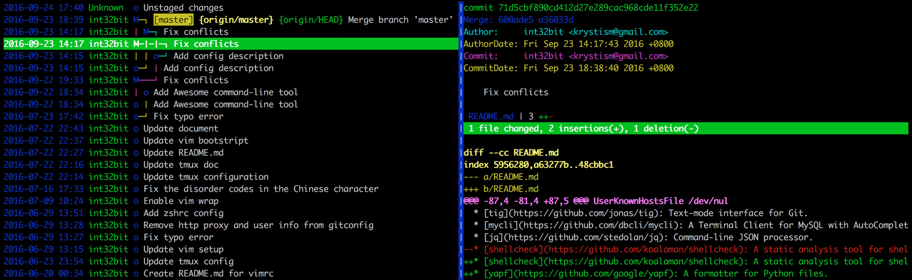

### [mycli](https://github.com/dbcli/mycli)

mysql客户端，支持语法高亮和命令补全，效果类似ipython，可以替代mysql命令。

### [jq](https://github.com/stedolan/jq)

json文件处理以及显示，可以替换`python -m json.tool`。

### [shellcheck](https://github.com/koalaman/shellcheck)

shell脚本静态检查工具，能够识别语法错误以及不规范的写法。

### [yapf](https://github.com/google/yapf)

Google开发的python代码格式规范化工具，支持pep8以及Google代码风格。

### [mosh](https://mosh.org/#getting)

可以替代ssh，连接更稳定，即使IP变了，也能自动重连。

### [fzf](https://github.com/junegunn/fzf)

命令行下模糊搜索工具，能够交互式智能搜索并选取。

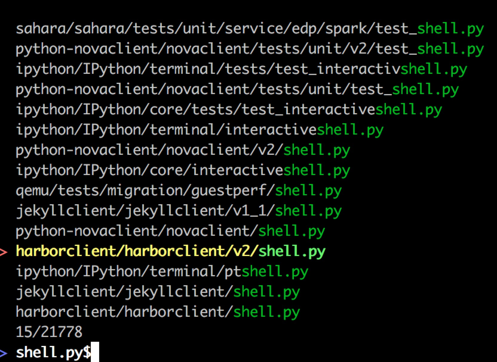

### [PathPicker(fpp)](https://github.com/facebook/PathPicker)

在命令行输出中自动识别目录和文件，交互式选择后使用EDTOR打开.

```
git diff HEAD~8 --stat
```

输出如下:

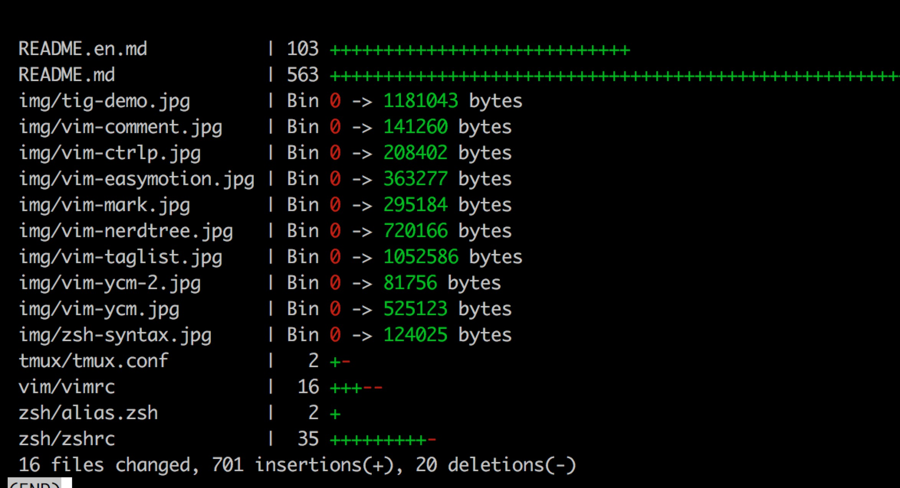

```
git diff HEAD~8 --stat | fpp
```

可以光标选择文件打开或者执行命令:

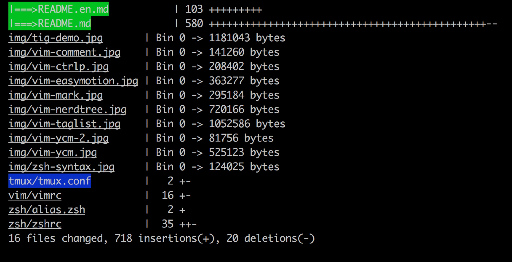

绿色显示的表示我们选中的文件，此时输入enter键将调用编辑器打开选中的文件，也可以按c进入命令模式，可以输入执行的命令，选中的文件将作为命令的输入文件。

### [pandoc](http://pandoc.org/)

Markdown，HTML，PDF，LaTEX等文档格式之间的命令行转换工具。

支持PDF转化需要依赖pdflatex:

```
brew cask install mactex
```

把`README.md`转化为PDF格式:

```bash
pandoc -f markdown_github -t latex -o README.pdf README.md
```

### [htop](https://hisham.hm/htop/)
 
可以代替top命令，提供更美观、更方便的进程监控工具。

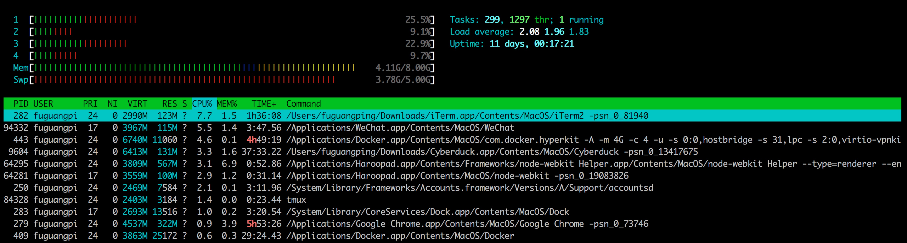

### [axel](http://axel.alioth.debian.org/)

多线程下载工具，下载大文件时可以替代curl、wget。

```sh
axel -n 20 http://centos.ustc.edu.cn/centos/7/isos/x86_64/CentOS-7-x86_64-Minimal-1511.iso
```


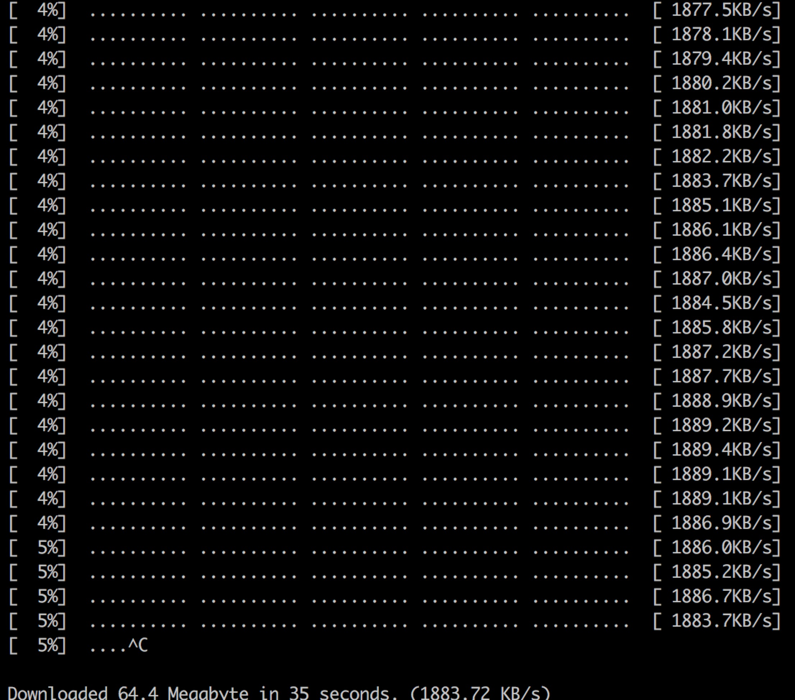

yum、gentoo partage等包管理工具能配置axel为下载工具替代curl。Homebrew从2013年开始提出使用axel下载，但目前好像尚未实现，参考[#19802](https://github.com/Homebrew/legacy-homebrew/issues/19802)。


## 参考

1. [vim-sdf13](http://vim.spf13.com/)。
2. [所需即所获：像 IDE 一样使用 vim](https://github.com/yangyangwithgnu/use_vim_as_ide)。
